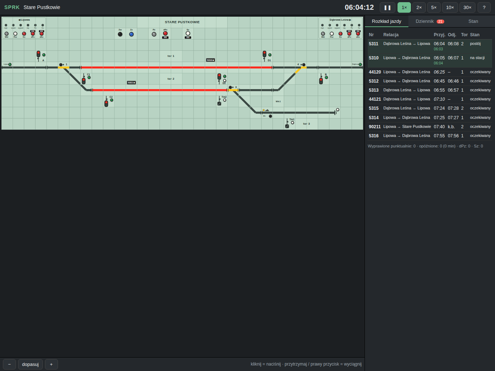

# SPRK – Polish Railway Traffic Control Simulator

A browser-based simulator of a Polish train dispatcher's work at a **cube-type control desk**
(*pulpit kostkowy*, relay interlocking type E), modelled on the ISDR simulator.
Runs in desktop browsers and on iPad (touch support). No frameworks: plain JavaScript (ES modules) + SVG.



Live version: https://budnix.github.io/SPRK/

## Getting started

```bash
npm install
npm run dev        # http://localhost:5173  (Vite; add --host to reach it from an iPad on the LAN)
npm test           # logic tests (node --test)
npm run build      # static build in dist/ (for GitHub Pages: VITE_BASE=/SPRK/)
```

Station selection: `?stacja=<id>` (default `stare-pustkowie`).

## What is in version 0.1

* **Modular desk tiles** (`src/tiles/registry.js`): straight / diagonal / curved track, point (turnout),
  crossing, buffer stop, signal repeaters (main signal and shunting signal) with buttons, group buttons with
  counters, Eap line-block panel, labels. A new tile type is one registry entry plus one drawing function.
* **Type E interlocking** (`src/model/Interlocking.js`): two-button route setting, automatic point setting
  in routes, route locking (white), track occupancy (red), point position (yellow), flank protection,
  overlaps, derailers, sectional release, route cancel with timed release, emergency release and
  substitute signal with counters, individual point locking, run-through (trailing) detection,
  signal aspects per the Polish Ie-1 instruction (S1–S5, S10–S13, Ms1/Ms2, Sz).
* **Eap semi-automatic line block** (`src/model/Block.js`): Wbl, Poz, Ko, dPo, dKo; neighbouring
  stations are driven by AI (they request permission, dispatch trains per the timetable, confirm arrival).
* **Train movement** (`src/model/Train.js`): trains run over the real track topology and current point
  positions, brake for stop signals, 40 km/h over diverging points, 20 km/h on a substitute signal,
  platform stops per timetable, non-stop passes, terminating trains, shunting under Ms2.
* **Side panel**: clock and time factor (1–30×), timetable with live status and delays, event log with
  messages from neighbouring stations, block / route / counter state, switching a train to shunting mode,
  built-in manual (?).
* **Disruptions**: inbound delays, equipment faults (dark signal, point without detection, false track
  occupancy, line block without communication), extra trains; seeded so a shift can be replayed.
* **Communication**: telephone train reporting per Ir-1 formulas when the block fails, radio calls from drivers,
  written orders „S” for passing a signal at Stop.
* **Shift report**: scoring of every procedural decision (punctual dispatch, holding trains, dPz, dPo/dKo,
  Sz, orders, wrong formulas, run-throughs) with a grade at the end of the shift.
* **Shunting tasks**: terminating trains must be stabled on a siding and brought back as a new train.
* **Control systems as strategies** (`src/srk/`): each station declares its interlocking type. Type E relay
  interlocking is operated on the cube desk (two-button commands, sealed counters); computer interlocking
  (Sopot) is operated on a monitor in the style of Polish CBI workstations (ISKRA-SRK / EbiScreen): dark
  schematic, element command menus, special commands with confirmation. The interlocking logic is shared;
  the setting *Stanowisko obsługi* lets you run any station on either workstation. The four Tricity stations use
  computer interlocking as in reality (Ebilock 950, LCS Gdynia and SKM remote control); the fictional ones use type E.
* **Stations and scenarios**: Stare Pustkowie (single-track line, crossings, siding), Wola Pustkowska
  (double-track line with one-way blocks, a branch line with Eap, junction work) and **Gdynia Główna**
  (real station: 10 platform tracks, SKM tracks 501/502, lines 202, 250 and 201 in both directions, point and
  signal numbering from the 2024 station plan, 29 trains in two hours, two signal boxes GO and GO2 with
  dispatcher orders exchanged between them) and **Gdynia Orłowo** (its simpler neighbour on the same lines:
  platform tracks 1/2 and SKM 501/502, tracks 3, 4 and 6 of the Sopot EMU depot, siding 18 with a derailer,
  a two-step shunting move of a terminating unit from track 4 to track 6) and **Gdynia Chylonia** (junction of
  lines 202 and 250 with branches to the Gdynia Postojowa depot and Gdynia Port, SKM stabling tracks 21/22 behind a
  diamond crossing, slip point 38, two-stage departures through intermediate exit signals) and **Sopot** (a long
  station where one passage takes three routes: home signal → yard tracks 2a/1a → platform tracks 2/1 → line;
  SKM platform 1, stabling tracks 4/6/13, units stabled and brought back as new trains); each with scenarios such as
  a closed track, a point failure, a block failure or a peak with heavy disruptions.

## Operating the desk (short version)

| Action | How |
|---|---|
| Press a button | click / tap |
| Pull a button | hold for 0.5 s or right-click |
| Train route | green button of the start signal → green button of the end (signal or line exit `kW` / `kE`) |
| Shunting route | white button of the start → white button of the end (`kT3`, Tm, C2) |
| Put a signal to stop | pull the signal button |
| Cancel a route | `Pz` + signal button (timed release of 90 s when the approach section is occupied) |
| Emergency release | `dPz` + signal button (counted) |
| Substitute signal | `Sz` + green signal button (counted) |
| Point | `Zw` + point button; lock with `Zz` + point button |
| Line block | `Wbl` request permission, `Poz` grant permission, `Ko` confirm arrival |

Full manual: the **?** button in the app (in Polish, as is the whole UI, since the simulator follows Polish railway rules and terminology).

## Structure and roadmap

* `docs/STATION-FORMAT.md` – station definition format (the basis for a future station editor),
* `docs/ARCHITECTURE.md` – architecture, design rules, roadmap,
* `docs/SOURCES.md` – sources (Ie-1, Ir-1, ISDR documentation, descriptions of type E equipment).

The simulator is a simplification: interlocking details (timings, overlaps, flank protection) follow published
descriptions of type E equipment, not the dependency tables of specific signal boxes. Report differences – the model lives in one place.

## CI / deploy

Workflow `.github/workflows/ci.yml`: every push and pull request runs `npm test`; after the tests pass on
`main`, the app is built and published to GitHub Pages (`https://budnix.github.io/SPRK/`).
