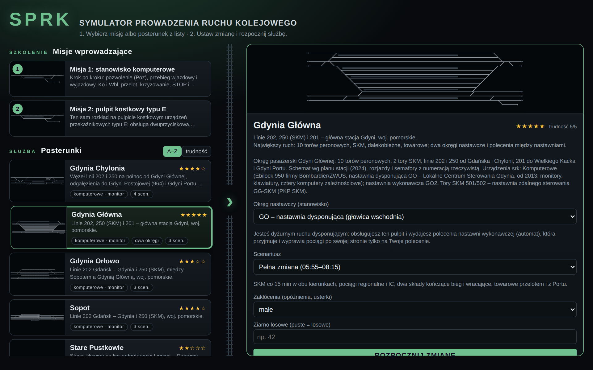
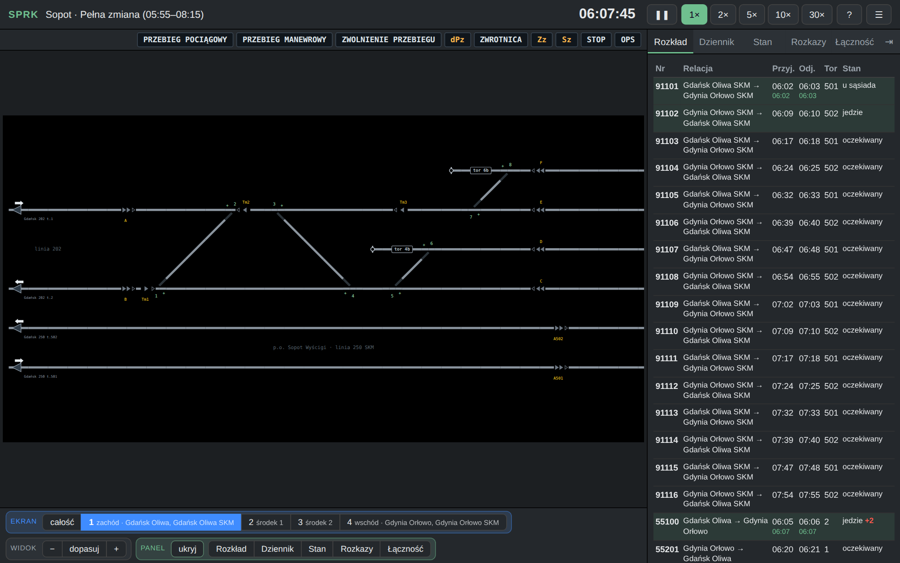
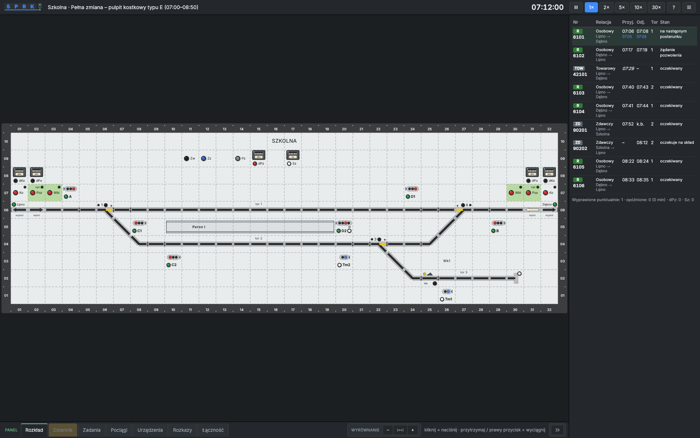
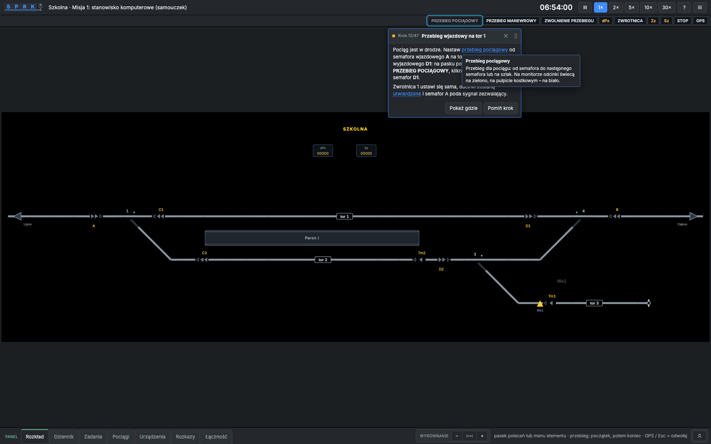
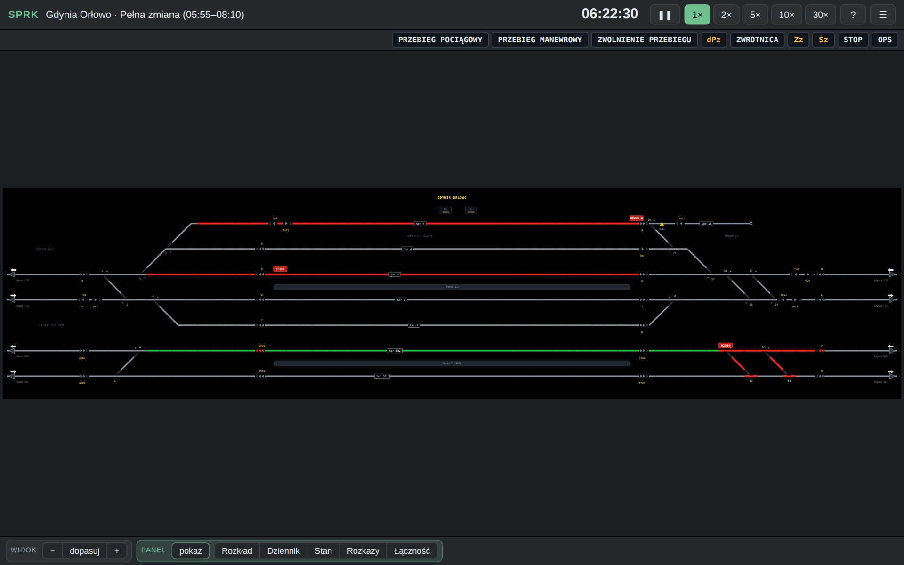

# SPRK – Polish Railway Traffic Control Simulator

**Symulator Prowadzenia Ruchu Kolejowego**: a browser game in which you are the train dispatcher of a Polish
station. You work either at a **type E relay interlocking desk** (*pulpit kostkowy*, modelled on the ISDR simulator)
or at a **computer-based interlocking workstation** (a monitor in the style of EbiScreen / ISKRA, drawn according to
the PKP PLK Ie-104 guidelines). Real Tricity stations, Polish signalling rules (Ie-1, Ir-1), guided missions for
beginners. Runs in desktop browsers and on iPad. Plain JavaScript (ES modules) and SVG, no frameworks.

Play it: **https://budnix.github.io/SPRK/**



## Screenshots

| Computer workstation (Sopot, screen 1 of 4) | Type E relay desk (Szkolna) |
|---|---|
|  |  |

| Guided mission on the training station | Gdynia Orłowo, whole station with SKM and regional traffic |
|---|---|
|  |  |

## Features

### Two workstations, one interlocking model
* **Type E relay desk** – cube tiles, two-button operation (press the first button, then the second within 6 s),
  pull a button to put a signal to stop, group buttons Zw / Zz / Pz / dPz / Sz with sealed counters, Eap line-block
  panels with Wbl / Poz / Ko / dPo / dKo, lamps for route locking (white), occupancy (red) and point position (yellow).
* **Computer workstation** – black schematic per Ie-104: grey / green / yellow / red / purple sections, signals drawn
  on the track line as chevrons pointing in the running direction, track numbers in frames on the line, named
  platforms, point fields with "+" at the normal leg, pink individual locks, blue selection frames, red train-number
  boxes. Commands from the command bar (PRZEBIEG POCIĄGOWY, PRZEBIEG MANEWROWY, ZWOLNIENIE PRZEBIEGU, dPz, ZWROTNICA,
  Zz, Sz, STOP, OPS) or from the element menu; special commands are confirmed with WYKONAJ and registered.
* Each station declares its real interlocking type; stations that exist in both forms offer a shift for each
  workstation (pick the scenario on the start screen). Symbol size (100–150 %) and track spacing are adjustable.

### Interlocking and line blocks
* Routes derived automatically from the track topology: point setting, route locking, flank protection, overlaps,
  derailers, sectional release, timed release (90 s) when the approach section is occupied, emergency release,
  individual point locking, run-through detection, signal aspects per Ie-1 (S1–S5, S10–S13, Ms1 / Ms2, Sz).
* **Eap semi-automatic block** on single-track lines (permission request and grant, end block, emergency releases)
  and **automatic block (SBL)** on double-track lines with a normal direction per track and direction change (Zk);
  neighbouring stations are driven by the simulator (they request, dispatch on time and confirm arrival).
* Block state is shown on the monitor at the line exit: track arrow (red when the section is occupied), direction
  arrow and a status label ("żąd.", "Wbl", "Ko", "tel."); dPo / dKo counters live in the *Stan* tab.

### Traffic
* Trains run over the real topology and current point positions, brake for stop signals, 40 km/h over diverging points,
  20 km/h on a substitute signal, train categories with realistic speeds and dynamics (EIP/IC/TLK/Regio/SKM/freight, capped by
  line speed), full relations in the timetable (e.g. IC 5100 „Kaszub” Kraków Gł. – Gdynia Gł.), platform stops per timetable, non-stop passes, terminating trains, units handed over
  as new trains, shunting under Ms2 with two-stage moves, stop 10 m before other stock.
* Timetable with live status and delays, event log, state tab (blocks, routes, counters, shunting tasks, train
  mode / direction), written orders "S" for passing a signal at Stop, telephone train announcements per Ir-1 formulas
  when a block loses communication, radio calls from drivers.
* Disruptions: inbound delays, faults (dark signal, point without detection, false occupancy, block without
  communication), extra trains; seeded so a shift can be replayed. Shift report with a score for every procedural
  decision.

### Stations
| Station | Equipment | Difficulty | What you get |
|---|---|---|---|
| **Szkolna** (fictional) | computer | 1/5 | Training station on a single-track line; linear timetable for the guided missions. |
| **Gdynia Orłowo** | computer | 3/5 | Lines 202 and 250 (SKM), tracks 3, 4 and 6 of the Sopot EMU depot, siding 18. |
| **Sopot** | computer | 4/5 | A passage takes three routes; SKM platform I, stabling tracks 4 / 6 / 13. |
| **Gdynia Chylonia** | computer | 4/5 | Junction of lines 202 and 250 with branches to Gdynia Postojowa and Gdynia Port. |
| **Rumia** | relay type E (desk) / computer | 4/5 | End of the SKM line 250 on line 202: SKM every 15 min on track 5, two-stage westbound departures (track signal, then the line signal), Eap block towards Reda. |
| **Reda** | relay type E (desk) / computer | 4/5 | Junction with line 213 to Hel: single-track Eap block, Hel shuttles on a stub platform track, two-stage departures on line 202. |
| **Tczew** | computer | 5/5 | Junction of lines 9, 131, 203 and 726/728: four platforms, 13 tracks, reversing regional trains to Chojnice, freight to Zajączkowo Tczewskie. |
| **Pruszcz Gdański** | computer | 4/5 | Line 9 before Gdańsk with branches 260 (Zajączkowo), 229 (Stara Piła) and 226 (Gdańsk Port Północny): single-track Eap blocks feeding freight across the main line. |
| **Gdańsk Główny** | computer | 5/5 | Terminus of line 9 with SKM platform III (Śródmieście ↔ Wrzeszcz), platforms I/II for line 9 / 202, stub platforms IV/V for trains terminating from Wrzeszcz, lines 227 and 249. |
| **Gdynia Główna** | computer | 5/5 | 10 platform tracks, SKM 501 / 502, lines 202, 250 and 201; the whole station from one workstation, split into screens. |

Real stations follow the current station plans (point and signal numbering, platform names, real interlocking:
Ebilock 950, LCS Gdynia, SKM remote control). Every station has several scenarios (full shift, a closed track, a point
failure, a block failure, a peak with heavy disruptions).

### Guided missions and the start screen
* **Mission 1** (computer workstation) and **Mission 2** (type E desk) on the training station: 47 steps each,
  a popup pinned to the element to use, highlighted targets, a clickable glossary of every abbreviation
  (Poz, Wbl, Ko, Pz, dPz, Sz, Zz, Zk…), feedback when you set the wrong route. The timetable walks through permission
  requests, entry and exit routes, a non-stop freight, a crossing, STOP and route release, points, shunting a
  terminating unit, a substitute signal after a signal fault and telephone announcements after a block fault.
* Popups can be dragged anywhere; by default they avoid the track plan and the command bars.
* Start screen like a mission select: missions first, then station cards with a schematic thumbnail, location, traffic
  and a star rating, sortable alphabetically or by difficulty; the briefing panel on the right sets district,
  scenario, disruptions and seed.

### Desk and screens
* Wide stations are split into logical screens that fit the browser width (cuts avoid point groups, two-column overlap,
  tabs / arrow keys / swipe); a command may start on one screen and end on another.
* Collapsible side panel with notification badges, zoom and pinch, light / dark / system theme, desk position,
  panel position (right / left / bottom). Defaults: system theme, panel at the bottom, symbols at 125 %.

### Interface language

The interface (menus, start screen, settings, report, side panel, tutorial box, manual) is available in Polish, English and
German: menu ≡ → Settings → Language (automatic = browser language, otherwise Polish). Railway terminology and desk
abbreviations (semafor, Pz, dPz, Sz, Wbl, Poz, Ko), the Ie-104 command bar, station descriptions, mission steps and the
simulation log stay in Polish, as in the Polish regulations the simulator follows. Dictionaries live in `src/i18n/`.

## Getting started

```bash
npm install
npm run dev        # http://localhost:5173  (Vite; add --host to reach it from an iPad on the LAN)
npm test           # logic tests (node --test)
npm run test:e2e   # browser tests (Playwright, Chromium); baselines in tests/e2e/__screenshots__
npm run build      # static build in dist/ (for GitHub Pages: VITE_BASE=/SPRK/)
```

URL parameters: `?stacja=<id>&scenariusz=<id>&zaklocenia=none|low|high&seed=<n>`.
Guided mission: `?stacja=szkolna&scenariusz=nauka-1`.

## Operating the desk (short version)

| Action | Type E desk | Computer workstation |
|---|---|---|
| Train route | green button of the start signal → green button of the end (signal or line exit) | PRZEBIEG POCIĄGOWY → start signal → end signal or line arrow |
| Shunting route | white button of the start → white button of the end | PRZEBIEG MANEWROWY → start → end |
| Signal to stop | pull the signal button | STOP → signal |
| Cancel a route | `Pz` + signal button | ZWOLNIENIE PRZEBIEGU → signal |
| Emergency release | `dPz` + signal button (counted) | dPz → signal → WYKONAJ |
| Substitute signal | `Sz` + green signal button (counted) | Sz → signal → WYKONAJ |
| Point | `Zw` + point button; lock with `Zz` | ZWROTNICA → point; Zz → point → WYKONAJ |
| Line block | tiles at the end of the line track: arrows on the track, `Wbl` request, `Poz` grant, `Ko` confirm arrival, `Zk` on automatic block | click the line arrow: Wbl / Poz / Ko, or Zk on automatic block |

Full manual and glossary: the **?** button in the app (Polish, as is the whole UI, since the simulator follows
Polish railway rules and terminology).

## Project structure

* `src/model/` – simulation (interlocking, line block, trains, traffic, faults, communication, scoring); no DOM,
* `src/render/` – desk and monitor renderers, screen split, station thumbnails,
* `src/srk/` – control-system strategies (type E desk, computer workstation) and the type E button protocol,
* `src/tutorial/` – guided missions (steps, progress engine, popups),
* `src/stations/` – station definitions (`docs/STATION-FORMAT.md`),
* `tests/` – Node tests (route matrices, full shifts, missions) and Playwright e2e tests with screenshot baselines,
* `docs/ARCHITECTURE.md` – architecture and design rules, `docs/SOURCES.md` – sources (Ie-1, Ir-1, Ie-104, station plans).

The simulator is a simplification: interlocking details (timings, overlaps, flank protection) follow published
descriptions of the equipment, not the dependency tables of specific signal boxes. Report differences – the model
lives in one place.

## CI / deploy

Workflow `.github/workflows/ci.yml`: every push and pull request runs `npm test` and the Playwright e2e suite
(in the `mcr.microsoft.com/playwright` container, so screenshot baselines match its fonts; two shards on two runners,
two workers each, pages served from the built bundle – `SPRK_E2E_PREVIEW=1`) in parallel with the Vite build; on
`main` the GitHub Pages deploy waits for all of them, so a push is live in about a minute and a half.
