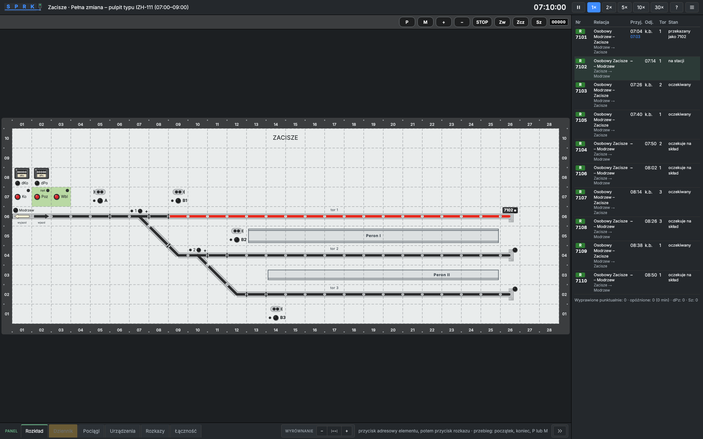
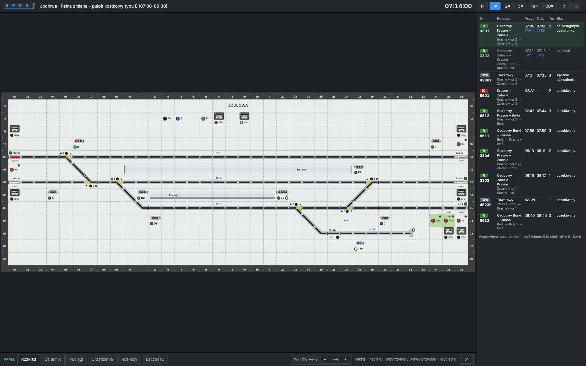
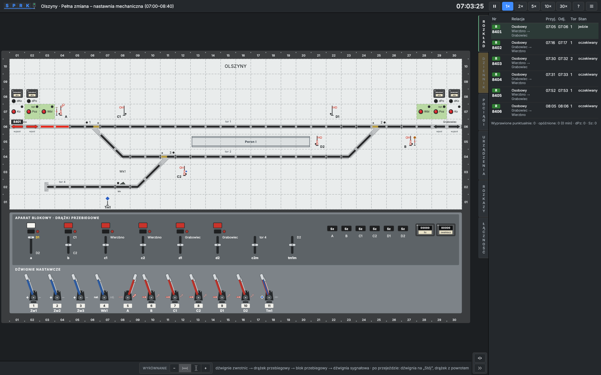

# SPRK – Polish Railway Traffic Control Simulator

**Symulator Prowadzenia Ruchu Kolejowego**: a browser game in which you are the train dispatcher of a Polish
station. You work either at a **type E relay interlocking desk** (*pulpit kostkowy*, modelled on the ISDR simulator)
or at a **computer-based interlocking workstation** (a monitor drawn according to the PKP PLK Ie-104 guidelines,
with a command bar, as an **EBILock 950 / EBIScreen** workstation with a text command line, or as a **MOR-3 / MOR-1**
workstation with object menus). Real Tricity stations, Polish signalling rules (Ie-1, Ir-1), guided missions for
beginners. Runs in desktop browsers and on iPad. Plain JavaScript (ES modules) and SVG, no frameworks. One bundled typeface
(Inter, SIL OFL) so the desk, the monitor and the interface look the same on every system.

Play it: **https://budnix.github.io/SPRK/**


## Screenshots

| Computer workstation (Sopot, screen 1 of 3) | Type E relay desk (Szkolna) |
|---|---|
|  |  |

| Guided mission on the training station | Gdynia Orłowo, whole station with SKM and regional traffic |
|---|---|
|  |  |

| Type IZH-111 dark relay desk (Zacisze, mission 3) | Type E relay desk on a double-track line (Jodłowa, mission 2) |
|---|---|
|  |  |

| Mechanical signal box with semaphore signals (Olszyny, mission 4) |
|---|
|  |

## Features

### Six workstations, one interlocking model
* **Type E relay desk** – cube tiles, two-button operation (press the first button, then the second within 6 s),
  pull a button to put a signal to stop, group buttons Zw / Zz / Pz / dPz / Sz with sealed counters, Eap line-block
  panels with Wbl / Poz / Ko / dPo / dKo, lamps for route locking (white), occupancy (red) and point position (yellow); signal repeaters with one green
  lamp for every proceed aspect, a red lamp for stop and a white one for Ms2 / Sz (flashing); black group buttons;
  a derailer lamp that shows yellow only when the derailer is off the rail.
* **Computer workstation** – black schematic per Ie-104.1: grey / green / yellow / red / pink sections (a closed track
  is a double line in its state colour), signals on the track line – a filled triangle (with shunting aspects plus an
  open arrowhead, a shunting signal only an open arrowhead with a turquoise number), plain track numbers on the line,
  named platforms, point Z fields ("+" at the normal leg, empty while moving, white / red flashing without detection /
  after a run-through), derailers as Z fields, route ends as a rectangle (train) or half circle (shunting), line-block
  arrows grey / yellow / red, one synchronous 1 Hz blink, train numbers on the track axis. Commands per Ie-104.1 §12
  from the command bar (PRZEBIEG POCIĄGOWY, PRZEBIEG MANEWROWY, ZCZ, ZD – ZDP / ZDM, Plus / Minus, Zmk / oZmk, SZ,
  Stój, Stop / oStop, OPS) or from the element menu; special commands (SZ, ZDP, dPo, dKo) mark the element orange (the
  picture turns grey before SZ), can be confirmed with WYKONAJ only after 5 s, cancel themselves after 60 s and block
  other commands meanwhile.
* Each station declares its real interlocking type; stations that exist in both forms offer a shift for each
  workstation (pick the scenario on the start screen). Symbol size (100–150 %) and track spacing are adjustable.

* **Type IZH-111 relay desk** – a dark desk (lamps are off in the normal state): one address button per element and
  a separate group of order buttons (P, M, +, −, STOP, Zw, Zcz, Sz). A route is the start address, the end address and
  an order; Zcz releases a train route after 120 s; STOP with a signal address closes the signal (red flashing lamp)
  until Zw cancels it. Available as a shift on the training station.
* **Mechanical signal box** – an illuminated track diagram above a lever frame: numbered levers (blue for points
  and derailers, red for signals), route levers and route block windows. You throw the points yourself, lock the
  route with the route lever, lock the route block, then pull the signal lever; after the train the signal lever and
  the route lever go back. A lever points up when normal and hangs down when reversed; a signal that shows both Sr2
  and Sr3 has two levers (A¹, A²). The route lever also has an intermediate position that locks the points without
  giving a signal – for a movement on the substitute signal Sz. Semaphore signals with moving arms (Sr1 / Sr2 / Sr3), distant discs at entry signals and
  shunting discs; arms, discs and levers move with a short animation (off when the system asks for reduced motion).
  Played in mission 4 at Olszyny.
* **EBILock 950 workstation (EBIScreen)** – the same Ie-104 picture, operated the EBIScreen way: right click on an
  object (tablet: hold) opens its command menu, left click on the start signal and right click on the end set up a
  route; every command lands in a text command line (`POC A D1`, `ZWP 3`, `SES A`, `ITS 2` – objects named as on the
  picture; station identifiers work too) and is sent only with
  *Execute* (or Enter, F12 jumps to the line). Alternative ways are chosen with an intermediate point (light blue frame).
  The substitute signal is a two-part special command (SZI marks the signal, SZW 5–30 s later). An events and alarms
  window lists events and alarms (active / cleared, acknowledged / not). Played in mission 5 at Brzezina and available as
  a shift on the training stations.
* **MOR-3 workstation (MOR-1 desk)** – the same Ie-104 picture, operated with object menus: click an object for a
  violet outline and its commands (Stój, Stop / oStop, ZCZ / oZCZ, ZD, SZ; Plus, Minus; Zmk / oZmk…); for a route click
  the start, then the target (signal, track or end triangle) instead of a menu command and pick *Pociąg* / *Manewr* – or
  drag with the right mouse button. Violet commands need a confirmation, red ones are special (confirmation and a
  special-command counter); while one waits, no other command is accepted (Ie-20). A messages / alarms window sits
  below the picture; alarms are acknowledged with a double click. Operation follows the SPE simulator's description of
  the MOR-1 desk (no public station manual). Played in mission 6 at Kalinowo (and its full shift there).

### Interlocking and line blocks
* Routes derived automatically from the track topology: point setting, route locking, flank protection, overlaps,
  derailers, sectional release, timed release (90 s) when the approach section is occupied, emergency release,
  individual point locking, run-through detection, signal aspects per Ie-1 (S1–S5, S10–S13, Ms1 / Ms2, Sz).
* **Eap semi-automatic block** on single-track lines (permission request and grant, cancelling a request by pulling
  Wbl, end block, line interlock Pwl after an exit signal; dPo locks the starting block after a departure on a
  substitute signal, dKo prepares the end block before an entry on it – neither resets the block)
  and **automatic block (SBL)** on double-track lines with a normal direction per track and direction change (Zk)
  agreed with the neighbour (our request, or our consent to theirs – the time goes to the log);
  neighbouring stations are driven by the simulator (they request, dispatch on time and confirm arrival).
* Block state is shown on the monitor at the line exit as in the PKP PLK Ie-104.1 guideline: track arrow (red when
  the section is occupied) and the block direction arrows above the track – neutral head/box/head, one arrow towards
  the station (ENTRY) or towards the line (EXIT), with the arrow head and shaft coloured per the guideline's tables
  (blinking yellow head – permission requested, red – direction used, red shaft – exit signal cleared, white/red –
  block fault) – and, on Eap blocks, the Ko/dKo symbol (green – arrival to confirm, blinking yellow – after dKo).
  Everything blinks in one shared screen phase. dPo / dKo counters live in the *Stan* tab.

### Traffic
* Trains run over the real topology and current point positions, brake for stop signals, 40 km/h over diverging points
  (the whole train, and up to the end of the switch zone after a 40 km/h signal aspect), 40 km/h on a substitute signal or written order (to the end of the points when leaving for the line), train categories with realistic speeds and dynamics (EIP/IC/TLK/Regio/SKM/freight, capped by
  line speed); freight trains carry the PKP PLK train kind from the Network Statement (TM bulk, TN non-bulk, TD intermodal,
  TK station and siding service, TS empty wagons to/from repair, LT light engine; the third letter is the traction, e.g.
  TME electric, TDS diesel), a length and a gross mass – heavier trains accelerate more slowly; the timetable row tooltip
  shows the kind, speed, length and mass; each train shows its rolling stock – a multiple unit such as „2 × EN57” or
  a locomotive such as „ET22”, drawn each shift from types that run in the Tricity area (SKM, Polregio, PKP Intercity,
  freight carriers; diesel units on non-electrified lines), the same set for a train formed from an arriving one – in
  the timetable tooltip and on the trains tab; the train runs with exactly that stock, using published vehicle data:
  a multiple unit starts with its type's acceleration (two coupled units like one), a locomotive's starting tractive
  effort is shared by its own mass and the load behind it (coaches from the train length, or the freight train's gross
  mass), and at speed the vehicle's power limits acceleration – a longer or heavier train, or an older or weaker
  vehicle, takes longer to reach line speed (an EN57 needs much longer than an Impuls, a diesel 754 with a long TLK
  minutes); a vehicle slower than the timetable is not assigned unless the station pins it, and then it limits the
  train's speed (shown in the tooltip); trains brake as a driver would: each driver plans a comfortable share of the
  vehicle's service braking (a little different on every train), starts braking early enough for the brakes to build
  up and eases off over the last metres before the stop; braking depends on the train – multiple units brake hardest,
  loco-hauled passenger trains as their speed requires, freight trains by their load (a heavy or long freight train
  needs much longer to stop and a long one stops without easing off); a signal dropping to "Stop" too close still means
  full or emergency braking; full relations in the timetable (e.g. IC 5100 „Kaszub” Kraków Gł. – Gdynia Gł.), platform stops per timetable (the train stops along the drawn platform rather than at its far end: the head at about three quarters of the platform, a train longer than half the platform in its middle, a stub track up to the platform end – a few metres different every time – and the train waits there for the exit signal), non-stop passes, terminating trains, units handed over
  as new trains, shunting under Ms2 with two-stage moves, running onto an occupied track up to the standing stock (last 50 m at 3 km/h).
* A point without detection is secured on site from the Equipment tab (a worker, about 3 minutes); then a train can
  pass it on a substitute signal or a written order.
* Movement authority: a train moves only on a train proceed aspect, a substitute signal or a written order – never on
  Ms2 – and leaves for the line only through an exit route; after reversing or switching from shunting it waits for
  the signal in front of it. A shunt move starts only on Ms2 / M2 of its own signal, and Ms2 goes out once the whole
  consist has passed.
* Timetable with live status and delays, event log, state tab (blocks, routes, counters, shunting tasks, train
  mode / direction), trains tab that says why a train is standing past its departure (no route, dark or stopped signal,
  no permission, block without communication – ask by phone, then Sz or a written order), written orders "S" for passing a signal at Stop, telephone messages per Ir-1 forms (1a / 4a on
  single-track lines for every train, departure notices on double-track lines – sent automatically or by you, see
  Settings), telephone block working when a block loses communication, holding a neighbour's train with „Stój pociąg nr …” when
  you have no track for it, radio calls from drivers, a radio permission for a shunt move past a damaged shunting signal
  once its route is set (Ir-9 §10(15)), radio talk with the driver (Ir-5 call format) when you switch a train between
  train and shunting mode or reverse it. Reversing takes 45–75 s while the driver walks to the cab at the other end:
  the train stays put even on a proceed signal, the trains tab counts down, and the driver reports ready by radio. New messages raise a counter and highlight the Comms tab; a switch in that tab
  turns these notifications off (handy with automatic telephone routine).
* Disruptions: inbound delays, random faults during the shift (dark signal, point without detection, false occupancy,
  block without communication), extra trains; seeded so a shift can be replayed. A signal that drops in front of a
  train because of a device fault costs no points; a train that stopped past such a signal continues on a written
  order „S”; a route that did not release behind a train because of a faulty track circuit is released with the
  emergency release at no cost. Waiting you could not avoid costs nothing: a shunting task's deadline moves by the
  unit's inbound delay (once the neighbour reports it) and by the time a fault with no way around blocked every
  shunting path to the target track. A substitute signal given with a two-step command (EBILock SZI → SZW, MOR-3,
  the monitor's special command) is judged when you choose it, so a fault repaired before you confirm still excuses
  it. Shift report with a score for every procedural
  decision. A train left unhandled at the end of the shift costs points only if you could have handled it: one that
  a neighbour sent too late to make it before the end is listed as "delayed by the neighbour, no penalty", and extra
  trains at high disruptions are always planned inside the shift.

### Stations
The fictional training stations (Szkolna, Jodłowa, Zacisze, Olszyny, Brzezina, Kalinowo) are not in the list of stations for a
regular shift; a mission never switches workstations, so the mission briefing offers the tutorial and the station's
full shift on the same workstation (MOR-3 only at Kalinowo, mission 6).

| Station | Equipment | Difficulty | What you get |
|---|---|---|---|
| **Szkolna** (fictional) | computer / relay type E / relay type IZH-111 / mechanical / EBILock 950 | 1/5 | Training station on a single-track line; mission 1. |
| **Jodłowa** (fictional) | relay type E / IZH-111 / computer / mechanical / EBILock 950 | 2/5 | Training station on a double-track line with a single-track branch: one-way blocks, overtaking on track 3; mission 2. |
| **Zacisze** (fictional) | relay type IZH-111 / type E / computer / mechanical / EBILock 950 | 1/5 | Training terminus of a single-track line: three stub tracks, every train reverses; mission 3. |
| **Olszyny** (fictional) | mechanical / relay type E / IZH-111 / computer / EBILock 950 | 2/5 | Training station on a single-track line with a goods siding and a protecting derailer; mission 4. |
| **Brzezina** (fictional) | EBILock 950 | 2/5 | Training station on a double-track line with automatic block: two main and two loop tracks, overtaking; mission 5. |
| **Kalinowo** (fictional) | MOR-3 | 3/5 | Training junction of three single-track lines (Eap everywhere): crossings, a branch, a freight without stopping; mission 6. |
| **Gdynia Orłowo** | computer | 3/5 | Lines 202 and 250 (SKM), tracks 3, 4 and 6 of the Sopot EMU depot, siding 18. |
| **Sopot** | computer | 4/5 | A passage takes three routes; SKM platform I, stabling tracks 4 / 6 / 13. |
| **Gdynia Chylonia** | computer | 4/5 | Junction of lines 202 and 250 with branches to Gdynia Postojowa and Gdynia Port. |
| **Rumia** | relay type E (desk) / computer | 4/5 | End of the SKM line 250 on line 202: SKM every 15 min on track 5, two-stage westbound departures (track signal, then the line signal), Eap block towards Reda. |
| **Reda** | relay type E (desk) / computer | 4/5 | Junction with line 213 to Hel: single-track Eap block, Hel shuttles on a stub platform track, two-stage departures on line 202. |
| **Tczew** | computer | 5/5 | Junction of lines 9, 131, 203 and 726/728: four platforms, 13 tracks, reversing regional trains to Chojnice, freight to Zajączkowo Tczewskie. |
| **Pruszcz Gdański** | computer | 4/5 | Line 9 before Gdańsk with branches 260 (Zajączkowo), 229 (Stara Piła) and 226 (Gdańsk Port Północny): single-track Eap blocks feeding freight across the main line. |
| **Gdańsk Główny** | computer | 5/5 | Terminus of line 9 with SKM platform III (Śródmieście ↔ Wrzeszcz), platforms I/II for line 9 / 202, stub platforms IV/V for trains terminating from Wrzeszcz, lines 227 and 249. |
| **Gdynia Główna** | computer | 5/5 | 10 platform tracks, SKM 501 / 502, lines 202, 250 and 201; the whole station from one workstation, split into screens. |

Real stations follow the current station plans (point and signal numbering, platform names, real interlocking:
Ebilock 950, LCS Gdynia, SKM remote control). Every station has several scenarios (full shift, a closed track, a point
failure, a block failure, a peak with heavy disruptions).

### Duty at a time of your choice
On every duty station you choose **when** and **how long** you work: any full hour of the day and 30 minutes, 1, 2 or
3 hours – a duty may run past midnight (23:00–02:00). The timetable is built for
that time of day from the station's own pattern: the morning and afternoon peaks carry the densest passenger traffic,
daytime and evening run fewer suburban and regional trains, and at night almost only freight trains run – they take the
paths of the passenger trains that do not run then. Long-distance trains carry the names and routes of real PKP
Intercity trains travelling the same way (IC „Lazur” Łódź Fabr. – Gdynia Gł., EIC „Jantar” Warszawa Zach. – Hel…), taken
from a nationwide list in `src/model/data/namedTrains.js`. Every duty is a little different (which services run, where freight
trains appear); the seed in the address reproduces the same duty. Traffic outside the morning pattern is generated by
the game, not taken from a real timetable (`docs/SOURCES.md`). Scenarios with a scripted fault or a closed track stay
available as special scenarios, and stations with two workstations let you pick the workstation – for the duty and for
the special scenarios alike.

### Guided missions and the start screen
* Six missions, each on **its own training station** with a different track layout and timetable:
  **Mission 1** – computer workstation at Szkolna (single-track line: permissions, crossing, shunting, substitute
  signal, telephone announcements); **Mission 2** – type E desk at Jodłowa (double-track line: traffic without
  permissions, overtaking, a branch with the Eap block); **Mission 3** – type IZH-111 desk at Zacisze (terminus:
  stub tracks, reversing, two consists in the station); **Mission 4** – mechanical signal box at Olszyny (point and
  derailer levers, route lever, route block, signal lever, crossing with a protecting derailer); **Mission 5** – EBILock 950
  workstation at Brzezina (double-track line with automatic block: right-click menus, the command line and *Execute*,
  typed commands, overtaking, the events and alarms window, closing a track with a broken rail); **Mission 6** – MOR-3
  workstation at Kalinowo (junction of three single-track lines: object menus, route by clicking the target or dragging,
  line block from the triangle menu, acknowledging alarms with a double click, resetting an axle counter with ZeroLO and
  a check run on the substitute signal). Commands are taught when they are needed – by the traffic
  or by a fault – and every mission ends with a different equipment fault and how to handle it (dark signal, block without
  communication, point without detection, false track occupancy, route block not released by the train, broken rail, axle counter),
  a popup pinned to the element to use, highlighted targets, a clickable glossary of every abbreviation
  (Poz, Wbl, Ko, Pz, dPz, Sz, Zz, Zk…), feedback when you set the wrong route. The timetable walks through permission
  requests, entry and exit routes, a non-stop freight, a crossing, STOP and route release, points, shunting a
  terminating unit, a substitute signal after a signal fault and telephone announcements after a block fault.
* Popups can be dragged anywhere; by default they avoid the track plan and the command bars.
* Station select like a game, with its own address for every screen (the browser Back button works): a title screen
  (last shift, duty, training, settings), the training line with the six missions as stops (finished ones are ticked),
  duty on a zoomable map of Poland (mouse wheel, pinch, drag, + / − buttons; voivodeships with their station count and
  the rail network from afar, the real course of the lines and the stations closer in) or as a list, with a search box (no Polish letters
  needed – "gdansk", a line number like "202", the equipment) and filters (workstation, difficulty 1–5, era,
  voivodeship, not played yet), a dispatcher's board per voivodeship with the real course of the railway lines
  (OpenStreetMap) and the stations as lamps with station signs, and a station page with a
  station sign, era tabs when a place has several editions, the shift choice and a green "start" button. Your best grade
  is stamped on the station card; the difficulty shows as one to five lamps. The shift report stamps the grade and shows the totals as
  desk counters with a status lamp; in settings the categories are stops on a track and the chosen option lights its
  lamp.

### Desk and screens
* Wide stations are split into logical screens that fit the browser width (cuts avoid point groups, two-column overlap,
  tabs / arrow keys / swipe); a command may start on one screen and end on another.
* Collapsible side panel with notification badges, zoom and pinch, light / dark / system theme, desk position,
  panel position (right / left / bottom); drag the edge between the desk and the panel (or the grip next to the panel
  button on a tablet) to resize it. The fit-to-width and fit-to-height buttons stay pressed and keep the desk fitted
  while the window or panel changes; + / − switch them off. Defaults: dark theme, panel at the bottom, whole desk on
  one screen, pinned edge columns on, symbols at 125 %.

### Interface language

The interface (menus, start screen, settings, report, side panel, tutorial box, manual) is available in Polish, English and
German: menu ≡ → Settings → Language (automatic = browser language, otherwise Polish). Railway terminology and desk
abbreviations (semafor, Pz, dPz, Sz, Wbl, Poz, Ko), the Ie-104 command bar, station descriptions, mission steps and the
simulation log stay in Polish, as in the Polish regulations the simulator follows. Dictionaries live in `src/i18n/`.

## Getting started

```bash
npm install
npm run dev        # http://localhost:5173  (Vite; add --host to reach it from an iPad on the LAN)
npm test           # logic tests (node --test)
npm run test:e2e   # browser tests (Playwright, Chromium); baselines in tests/e2e/__screenshots__
npm run survey     # engine survey: every station × scenario × seed run by the automatic dispatcher (jams, safety checks)
npm run check -- tczew:zmiana   # scenario checker: definition errors + shifts played by the automatic dispatcher, verdict per shift
npm run seed-scan -- --runs 30  # finds flaky tests: runs the Node tests under many repeatable "random" seeds, in parallel
npm run build      # static build in dist/ (for GitHub Pages: VITE_BASE=/SPRK/)
```

URL parameters: `?stacja=<id>&scenariusz=<id>&zaklocenia=none|low|high&seed=<n>`.
Guided mission: `?stacja=szkolna&scenariusz=nauka-1`.

## Operating the desk (short version)

| Action | Type E desk | Computer workstation |
|---|---|---|
| Train route | green button of the start signal → green button of the end (signal or line exit) | PRZEBIEG POCIĄGOWY → start signal → end signal or line arrow |
| Shunting route | white button of the start → white button of the end | PRZEBIEG MANEWROWY → start → end |
| Signal to stop | pull the signal button | Stój → signal (Stop / oStop – signal stopping) |
| Cancel a route | `Pz` + signal button | ZCZ → signal |
| Emergency release | `dPz` + signal button (counted) | ZD → signal (ZDP: → WYKONAJ after 5 s, counted; ZDM: ordinary) |
| Substitute signal | `Sz` + green signal button (counted) | SZ → signal → WYKONAJ after 5 s |
| Point | `Zw` + point button; lock with `Zz` | Plus / Minus → point; Zmk / oZmk → point |
| Line block | tiles at the end of the line track: arrows on the track, `Wbl` request, `Poz` grant, `Ko` confirm arrival, `Zk` on automatic block | click the line arrow: Wbl / Poz / Ko, or Zk on automatic block |

On the EBILock 950 workstation every action is a typed (or menu-picked) command sent with *Execute*: `POC` / `MAN`
(route), `PZW` (release), `PZA` (emergency release), `SES` / `SEO` (signal to stop / back), `ZWP` / `ZWM` (point),
`ZWS` / `ZWO` (point lock), `SZI` → `SZW` (substitute signal), `ITS` / `ITO` (close / reopen a track), `SSS` / `SSO`,
`SZO` (whole station), `WBL` / `POZ` / `KO` (line block).

Keyboard: **Space** pauses or resumes the clock, keys **1–5** pick the speeds from the header (1×, 2×, 5×, 10×, 30×),
**←** / **→** switch screens.

Full manual and glossary: the **?** button in the app (Polish, as is the whole UI, since the simulator follows
Polish railway rules and terminology).

## Project structure

* `src/model/` – simulation (interlocking, line block, trains, traffic, faults, communication, scoring); no DOM,
* `src/render/` – desk and monitor renderers, screen split, station thumbnails,
* `src/srk/` – control-system strategies (type E, IZH-111, mechanical, computer, EBILock 950, MOR-3) and their operating protocols,
* `src/tutorial/` – guided missions (steps, progress engine, popups),
* `src/stations/` – station definitions (`docs/STATION-FORMAT.md`),
* `tests/` – Node tests (route matrices, full shifts, missions, faults at fixed moments of a train's journey) and Playwright e2e tests with screenshot baselines,
* `scripts/survey.mjs` – engine survey (`npm run survey -- --help`): full shifts under disruptions run by the automatic dispatcher;
  reports trains that never reached their destination and safety-check violations; `--json` / `--compare` compare results before and after an engine change,
* `scripts/check-scenario.mjs` – scenario checker for adding scenario variants quickly (another start or length, a subset of trains, faults):
  `npm run check -- [station[:scenario] …] [--seeds 1-3] [--level none|low|high|all] [--extra min] [--tutorial] [--strict] [--verbose]`;
  `--start <hour> --minutes <30|60|120|180>` checks the duty at a chosen time instead (one timetable per seed and per workstation).
  It first validates the station and checks the scenario definition without playing (`src/model/scenarioCheck.js`: shift window,
  trains that can't appear, finish or would have to reverse, tracks and routes, shunting tasks, faults and closures pointing at
  missing elements, misspelled fields, timetable denser than the line), then plays each shift at an accelerated pace with the
  automatic dispatcher (levels none / low / high, seeds 1–3, until the end of the shift plus a margin) and reports per shift:
  OK / WARNINGS / ERRORS (plus notes that don't count) with the train, where it stands, since when, why (wait reason, route
  obstacles, the train in the way) and its last log entries. A scenario's rating comes from its definition and from shifts at
  its own level (no disruptions, or the level the scenario forces); warnings under player-chosen disruptions are listed as
  robustness. Exit code 1 on errors (with `--strict` also on warnings). Every scenario of every station also goes through the
  definition check and one played shift at its own level in `npm test`, which fails on errors and on repeatable warnings not
  accepted in `tests/scenario-accepted.js`; how to write a variant – `docs/STATION-FORMAT.md`, rules – `docs/ARCHITECTURE.md`
  („Automat sprawdzający scenariusze”),
* `scripts/named-trains.mjs` – builds `src/model/data/namedTrains.js`, the list of named PKP Intercity trains (category, name,
  stations along the route) used for long-distance trains in generated duties; run it again when the yearly timetable changes,
* `scripts/seed-scan.mjs` – flaky-test finder (`npm run seed-scan -- --help`): tests that create a shift without a `seed` get a
  different one on every run and may fail once in a hundred runs, usually in CI. The script runs every test file under many
  repeatable seed sets (`scripts/random-seed.mjs`, `SPRK_RAND=<n>`), one process per file and set on all cores, and prints
  the tests that failed with the command that reproduces each failure,
* `docs/ARCHITECTURE.md` – architecture and design rules, `docs/SOURCES.md` – sources (Ie-1, Ir-1, Ie-104, station plans).

The simulator is a simplification: interlocking details (timings, overlaps, flank protection) follow published
descriptions of the equipment, not the dependency tables of specific signal boxes. Report differences – the model
lives in one place.

## CI / deploy

Workflow `.github/workflows/ci.yml`: every push and pull request runs `npm test` and the Playwright e2e suite
(in the `mcr.microsoft.com/playwright` container; screenshot baselines are made on any computer with
`npm run test:e2e:update` – letters are hidden in the screenshots, so font rendering differences between systems don't
matter; two shards on two runners,
two workers each, pages served from the built bundle – `SPRK_E2E_PREVIEW=1`) in parallel with the Vite build; on
`main` the GitHub Pages deploy waits for all of them, so a push is live in about a minute and a half.
